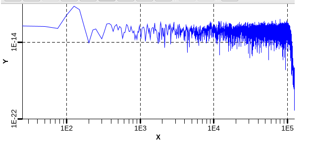

# Quartz Design Functional Testing

Updated: 24 Feb. 2025

## Linearity Testing

### Test setup

A Stanford Research Systems DS360 is used to generate a test signal. This signal is injected into all signal channels through DB37 testing cable.  
Unless otherwise noted testing parameters are as follows:

- Input into all channels  
- Board is set to 250kHz sampling.  
- Channels set to DC coupling  
- Amplitude of the test signal is stepped in 1V increments across the \+/-10V (20Vp-p) full listed input range

### Testing Results

Below is the plot showing all channels data while running the test.  

The DC voltage was stepped from \-10V through 10V at approximately 10 sec intervals. This gave \~250 million samples per step of data.  
The data was then analyzed to give an upper bound of linearity. The sample with the largest variance from the ideal count was collected and shown in the table below.  
![][image2]

Without gain or zero calibration applied the upper bound on linearity for these 32 channels are below

| Channel 1 | 0.1189% | Channel 17 | 0.1253% |
| :---- | ----: | :---- | ----: |
| Channel 2 | 0.1227% | Channel 18 | 0.1257% |
| Channel 3 | 0.1252% | Channel 19 | 0.1262% |
| Channel 4 | 0.1233% | Channel 20 | 0.1258% |
| Channel 5 | 0.1207% | Channel 21 | 0.1257% |
| Channel 6 | 0.1199% | Channel 22 | 0.1261% |
| Channel 7 | 0.1158% | Channel 23 | 0.1262% |
| Channel 8 | 0.1161% | Channel 24 | 0.1259% |
| Channel 9 | 0.1179% | Channel 25 | 0.1264% |
| Channel 10 | 0.1199% | Channel 26 | 0.1267% |
| Channel 11 | 0.1205% | Channel 27 | 0.1272% |
| Channel 12 | 0.1216% | Channel 28 | 0.1281% |
| Channel 13 | 0.1226% | Channel 29 | 0.1281% |
| Channel 14 | 0.1235% | Channel 30 | 0.1284% |
| Channel 15 | 0.1242% | Channel 31 | 0.1228% |
| Channel 16 | 0.1244% | Channel 32 | 0.1286% |

After applying a gain or zero calibration, the upper bound on linearity for these 32 channels are below

| Channel 1 | 0.0822% | Channel 17 | 0.0829% |
| :---- | ----: | :---- | ----: |
| Channel 2 | 0.0824% | Channel 18 | 0.0830% |
| Channel 3 | 0.0826% | Channel 19 | 0.0832% |
| Channel 4 | 0.0823% | Channel 20 | 0.0832% |
| Channel 5 | 0.0822% | Channel 21 | 0.0833% |
| Channel 6 | 0.0822% | Channel 22 | 0.0835% |
| Channel 7 | 0.0820% | Channel 23 | 0.0836% |
| Channel 8 | 0.0820% | Channel 24 | 0.0836% |
| Channel 9 | 0.0821% | Channel 25 | 0.0838% |
| Channel 10 | 0.0823% | Channel 26 | 0.0840% |
| Channel 11 | 0.0823% | Channel 27 | 0.0842% |
| Channel 12 | 0.0824% | Channel 28 | 0.0845% |
| Channel 13 | 0.0825% | Channel 29 | 0.0845% |
| Channel 14 | 0.0826% | Channel 30 | 0.0847% |
| Channel 15 | 0.0827% | Channel 31 | 0.0848% |
| Channel 16 | 0.0828% | Channel 32 | 0.0849% |

### Conclusion

It has been shown that an upper bound of linearity of the quartz design well exceeds the goal of 1%.  
It must also be pointed out that the test signal used only had an accuracy tolerance of 1%. This was not corrected for in the above analysis, pointing to the nominal linearity being better than the upper-bound  figures shown above.

## Crosstalk Testing

### Test setup

A Stanford Research Systems DS360 is used to generate a test signal. This signal is injected into a signal channel through DB37 breakout cable, while the other channels are shorted.  
Unless otherwise noted testing parameters are as follows:

- Input into channel 17 (centered in the board)  
  - No appreciable difference affecting conclusion on choosing another channel.  
- Board is set to 250kHz sampling.  
- Channels set to DC coupling  
- Amplitude of the test signal is set to \+/-10V (20Vp-p) representing the full listed input range

### Testing Results

Testing shows some crosstalk is noticeable between 10kHz-100kHz. Below 10kHz potential crosstalk is within the observed noise floor. Crosstalk is observed on physically adjacent channels that share the same digitizing ADC. Little to no crosstalk is seen on adject channels on a separate ADC.

Sweeping frequency from 100Hz to 100kHz over 10 seconds  
Channel 17 (channel with signal input):

Channel 18 (Adjacent Channel sharing ADC):  

Channel 16 (Adjacent Channel not sharing ADC):  

The following is some plots showing the worst case observed crosstalk  
FFT PLOT of input @99.9kHz
FFT PLOT of adjacent channels @99.9kHz

Below is a plot displaying the relative magnitude of the cross alk between the input channel and some adjunct channels.The input was a single tone starting at 100kHz and then stepping down by 10kHz every few seconds down to 10kHz.  

The upper red trace is showing the magnitude of the channel where input is present  
You can see there are 3 bands of channel magnitudes.  
The upper of these bands are adjacent channels on the same ADC.  
The middle band are channels on the sma ADC but on the opposite side of the board  
The lower band are other channels not sharing an ADC with the input channel.

Below is a table of results showing the worst case ratio seen at each of the sample rates

| frequency | input magnitude | crosstalk magnitude | ratio of crosstalk to input | crosstalk (dB) |
| :---- | ----- | ----- | ----- | ----- |
| 100 kHz | 4369600 | 80.42 | 54334.74 | \-94.702 |
| 90 kHz | 4349997 | 76.65 | 56751.43 | \-95.080 |
| 80 kHz | 4373394 | 73.20 | 59745.82 | \-95.526 |
| 70 kHz | 4358293 | 68.71 | 63430.26 | \-96.046 |
| 60 kHz | 4374473 | 65.18 | 67113.73 | \-96.536 |
| 50 kHz | 4363253 | 63.63 | 68572.26 | \-96.723 |
| 40 kHz | 4372892 | 61.26 | 71382.50 | \-97.072 |
| 30 kHz | 4333453 | 59.49 | 72843.39 | \-97.248 |
| 20 kHz | 4367424 | 58.75 | 74339.13 | \-97.424 |
| 10 kHz | 4381942 | 58.13 | 75381.77 | \-97.545 |

Next a sweep is performed from 1Hz to 2kHz over 10 seconds, using 25kHz sampling  
Ch17  

Ch18  

Measurement of crosstalk while running this sweep is at or better than 105dB, which isn’t discernible from any other non-input channel. The measurement is limited the board’s noise floor

### Conclusion

Our design greatly exceeds the F2.8 specification of less than \-80 dB DC to 2 kHz of crosstalk. Even when looking at the full bandwidth of the system we don’t encroach on this requirement.

## Alias Rejection Testing

### Test setup

A Stanford Research Systems DS360 is used to generate a test signal. This signal is injected into all signal channels through DB37 testing cable.  
Unless otherwise noted testing parameters are as follows:

- Input into all channels  
- Channels set to DC coupling  
- Board is set to 250kHz sampling.  
- Amplitude of the test signal is set to \+/-10V (20Vp-p) representing the full listed input range

### Testing Results

The easiest way to show the effectiveness of the built-in antialias filter of the ADC is to sweep the input frequency up to the sample frequency and look for reflections in the FFT. Below are such plots at each of the 4 higher sample rates

FFT of 100Hz \- 250kHz linear sweep over 10 seconds @ 250kHz sampling  

FFT of 100Hz \- 50kHz linear sweep over 10 seconds @ 50kHz sampling  

FFT of 100Hz \- 25kHz linear sweep over 10 seconds @ 25kHz sampling  

FFT of 10Hz \- 5kHz linear sweep over 25 seconds @ 5kHz sampling  

### Conclusion

Our design does not exhibit aliasing when frequencies beyond that Nyquist frequency of a sample rate are present. The built-in antialias filter of the ADC is appropriately functioning.  
See Antialiasing Section on page 63 of the AD7768 datasheet \[[link](https://www.analog.com/media/en/technical-documentation/data-sheets/ad7768-7768-4.pdf)\]

## 

## AC/DC Switching Testing

### Test setup

A Stanford Research Systems DS360 is used to generate a test signal. This signal is injected into all signal channels through DB37 testing cable.  
Unless otherwise noted testing parameters are as follows:

- Input into all channels  
- Board is set to 250kHz sampling.  
- Amplitude of the test signal is set to \+/-10V (20Vp-p) representing the full listed input range

### Testing Results

This will be tested by starting channel input in DC coupling mode with a 500Hz \+/-10V (20Vp-p) with a 5V DC offset. This will show clear signs of clipping as the signal will be outside the listed input range. The AC/DC coupling will be then toggled and we will immediately see the clipping disappear.  

### Conclusion

The AC/DC coupling functionality is fully working as expected in the design.  
