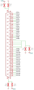

# Quartz DAQ-250-24 Datasheet

Osprey Quartz is a highly scalable EPICS native 24-bit 250KHz data acquisition system
consisting of one or more 2U 19-inch rack mounted chassis.
Each chassis can digitizer up to 32 channels connected through two standard DB37F connectors.
The input scale is fixed to $+-10$ volts.

Multiple chassis may be [connected together](system-setup.md#Topologies)
which maintaining a common sample clock phase.
This permits synchronous sampling with a very high channel count[^maxchan].

[^maxchan]: There is no hard upper limit on channel count.
  Sample clock synchronization quality degrades as timing network topology deepens.

## Parameters

| Parameter | Value |
| ---- | ---- |
| Height | 2U |
| Width | 19 Inch |
| Depth | 400 mm |
| Communication | 1Gbps Ethernet, RJ45 |
| Power Input Voltage | 12 VDC to 2 contact DC barrel Jack[^acdc] |
| Number of Analog channels | 32 (2x 16 pairs) |
| Analog Input | 2x DB37-F |
| Sample rates | 1K, 5K, 10K, 25K, 50K, 250K samples per second |
| AC/DC coupling | selectable per-channel |
| ADC Resolution | 24-bit |

## Absolute Maximums

| Specification | Minimum | Maximum |
| ---- | ---- | ---- |
| Ambient Temperature | 0C | 40 C |
| Ambient Humidity | | 90% non-condensing |
| Power Input Voltage[^acdc] | 0V DC | 13 VDC |
| Power Current | | 4A |
| Analog Input abs. voltage[^analogabs] | -15 V | +15 V (DC coupled) |
|                                       | -25 V | +25 V (AC coupled) |
| Analog Input diff. voltage[^analogdiff] | -30 V | +30 V |
| Pulse-per-second Input Voltage | -0.7 V | 5.5 V |

[^acdc]: 120V AC/DC converter included
[^analogabs]: Voltage applied to any DB37 pin with respect to chassis ground
[^analogdiff]: Voltage difference between each pair of pins

## Performance

| Specification | Minimum | Typical | Maximum |
| ---- | ---- | ---- | ---- |
| Power Input Voltage[^acdc] | 10 V | 12 V | 13 V DC |
| Analog Input Impedance | 999k ohm | 1M ohm | |
| Analog Input voltage | -10V | | 10V |
| Analog bandwidth | | | 100KHz @ 250Ksps|
|                  | | |  20KHz @ 50Ksps |
|                  | | |  10KHz @ 20Ksps |
|                  | | |  5KHz @ 10Ksps |
|                  | | |  2KHz @ 5Ksps |
|                  | | |  400Hz @ 1Ksps |
| Channel Cross-talk[^cross] | | | -94 dB |
| Analog linearity | | | |
| Pass-band ripple | 0.1 dB | | |
| Effective resolution | | 19 bits @ 250Ksps | |

[^cross]: Worst case of 100KHz measured on an adjacent channel on same side of PCB sharing ADC chip.

## Connectors

- Power Input.

2 contact barrel jack, positive inside.  Cliff Electronics [SCD-026](http://www.farnell.com/datasheets/1859067.pdf)

- Grounding stud

- Ethernet RJ45 UTP

- Timing, 8x LC duplex, multi-mode

- 2x DB37-F

Each DB37-F connector has 16 inputs pairs.

Board side connector is TE Connectivity [5747847-6](https://www.te.com/commerce/DocumentDelivery/DDEController?Action=showdoc&DocId=Catalog+Section%7F82068_AMPLIMITE_Right-Angle_Posted_Conn%7F0412%7Fpdf%7FEnglish%7FENG_CS_82068_AMPLIMITE_Right-Angle_Posted_Conn_0412.pdf%7F5747847-4)

- Pulse Per Second, BNC-F
