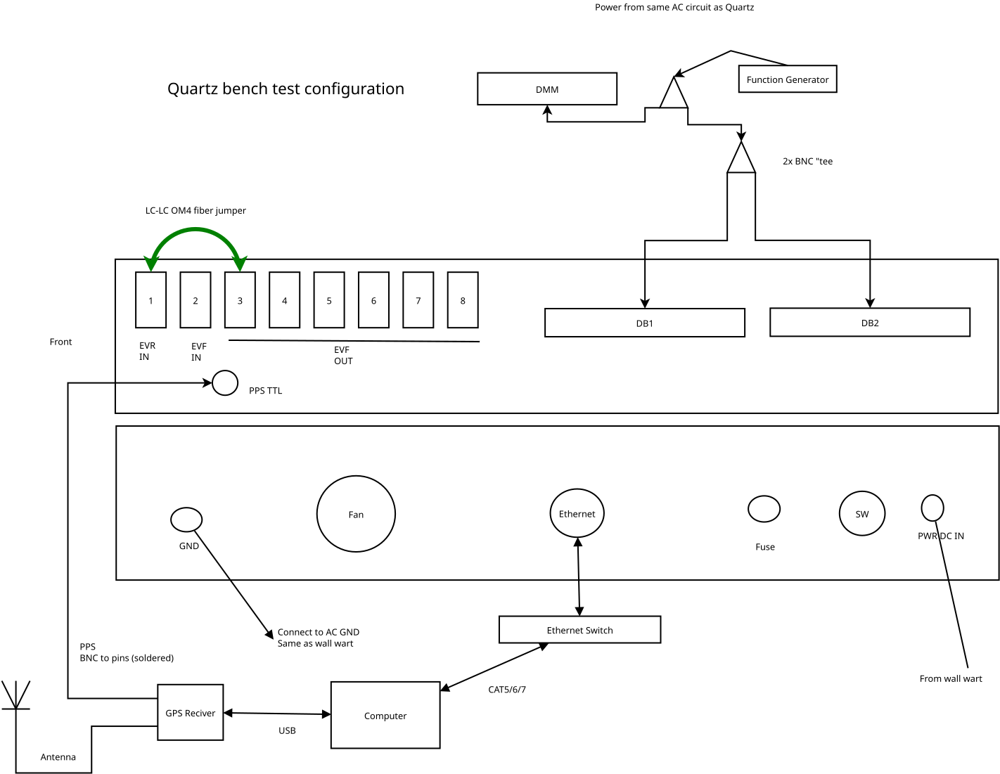
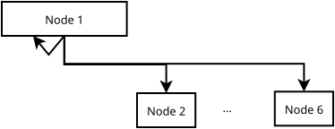
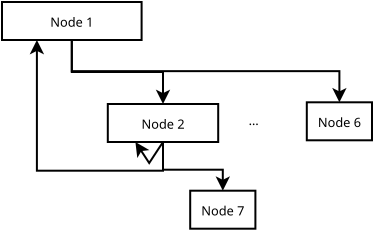

# Quartz ADC System Setup

This document describes setting up a new Quartz installation.

## Prerequisites

1. One or more Quartz ADC chassis
  - One 12V power supply for each
  - Ground connection (essential for measurement accuracy!)
2. Time server with 5V TTL PPS output
  - Either a dedicated ethernet enabled GPS receiver with NTP server
  - Another GPS receiver with 5V TTL PPS output, and a separate NTP server
3. Cables
  - cable to BNC-F on one Quartz chassis from time server (PPS)
  - LC duplex fiber patch cables
    - At least one is required to test a single chassis
  - Ethernet cable(s) to computer
4. Working Debian Linux 12 computer with internet access.

## EVG / Timing Master Node

In each installation, one chassis must be selected as a "master" node for the timing network.
This node will connect to the time server via. ethernet and pulse-per-second inputs and
provide timing and synchronization for all other chassis.

Any chassis may act as a "master" node.
This selection is made by configuring the NTP server through the
[application firmware console](ioc-setup.md#fpga-application-console).

### Time Server Setup

For production installations, a dedicated time server with GPS input, NTP server, and PPS output is recommended.

Alternately, for testing and development, the following parts may be assembled to provided a suitable
PPS, along with a software NTP server.

- [GPS GNSS with USB](https://www.adafruit.com/product/4279)
- [SMA to uFL adapter](https://www.adafruit.com/product/851)
- [GPS Antenna - External Active](https://www.adafruit.com/product/960)
- [BNC Male Plug Terminal Block](https://www.adafruit.com/product/2888)
- Suitable wire, soldering iron, and a steady hand.

## Connections

Summary of Quartz chassis connectors referenced below

- Fiber (LC)
  - Port 1 - EVR IN
  - Port 2 - EVG IN
  - Ports 3 -> 8 - EVF OUT
- PPS TTL (BNC)

## Topologies

### Single chassis

The minimal connections required to run a single chassis are:

- Port 3 -> Port 1
- Time server PPS output -> PPS TTL
- Ethernet connection between chassis, computer, and NTP server

### Up to 6 chassis

Up to 5 more chassis may be connected from Ports 4 through 8 on the "master" node
to EVR IN on each secondary node.

### 7 to 32 chassis

With more than six chassis, it is necessary to add tertiary (level 3) nodes from
one or more secondary (level 2) nodes.

Here each Level 2 node will connect to itself, and up to 5 other Level 3 nodes.

This arrangement require an alteration to the "master" node, which will no longer
be looped directly to itself.
Instead, the "master" node will be connected to itself through one of the level 2 nodes.

This maintains an equal propagation time from from the Ports 3 -> 8 on the "master"
node, and the Port 1's on each node (including the master).
